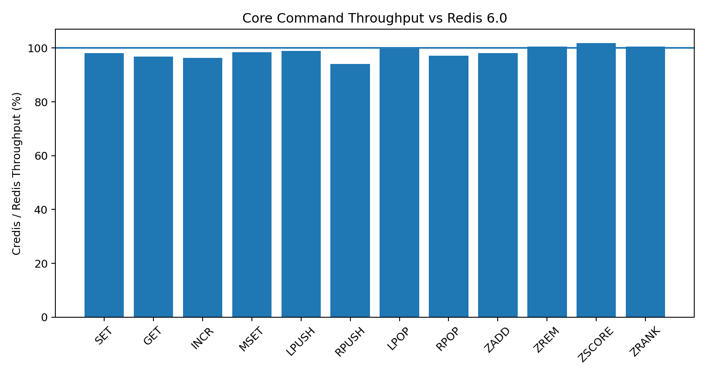
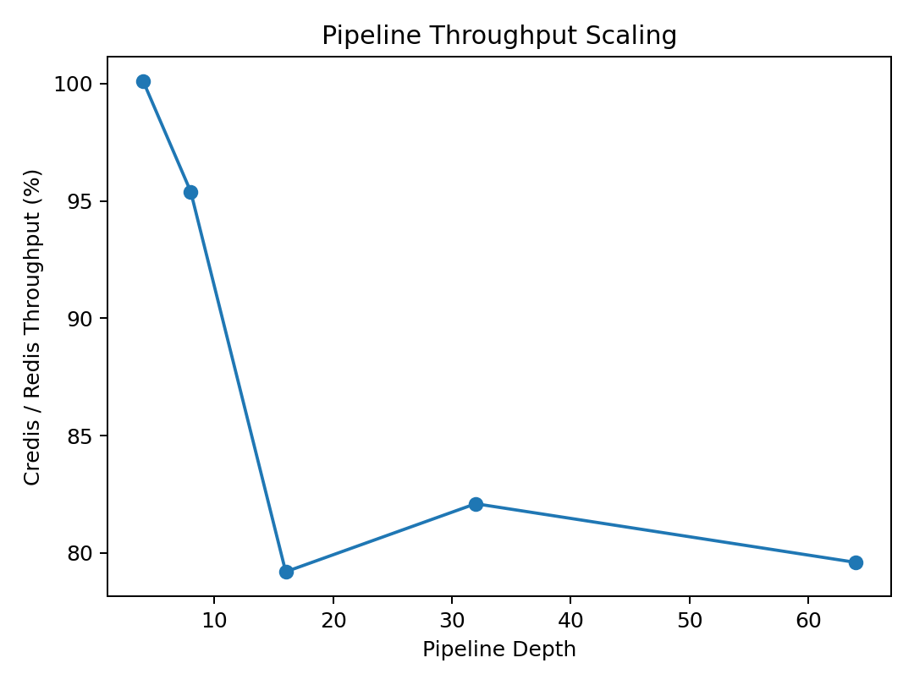
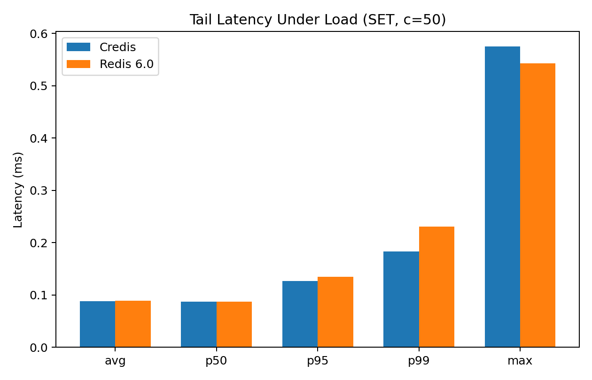

# Credis

[](https://github.com/Tenaryo/Credis/actions/workflows/ci.yml)
[](LICENSE)
[](https://en.cppreference.com/w/cpp/23)

A Redis 7.0-compatible server written from scratch in C++23. ~3,700 lines, zero dependencies, 793 KB stripped binary. Near-parity with Redis 6.0 on throughput and latency for core commands, reaching 95–102% of Redis in most benchmarks. Under high concurrency (500 clients), Credis achieves 110% Redis throughput with lower P99 tail latency. Implements the full single-threaded epoll reactor, RESP v2 pipelining with batched response encoding, master-replica replication with WAIT acknowledgment, blocking commands with O(1) dual-index wake queue, SortedSet with transparent hashing and zero-alloc lookups, and optimistic locking transactions — with no third-party libraries.

## Dependencies

- **C++23** compiler (GCC 13+ recommended)
- **CMake** 3.21+
- **POSIX** (epoll, sockets)

No Boost, no libevent, no hiredis.

## Performance

### Methodology

- Hardware: AArch64, GCC 14, Ubuntu, loopback TCP
- Throughput: `redis-benchmark -n 100000 -c 50 -q`
- Latency: `redis-benchmark -n 100000 -c 1 --precision 3` (Redis 7.2 benchmark)
- Persistence disabled on both servers
- Credis: `-O3 -march=native -flto` + PGO
- Redis: official 6.0.16 (jemalloc)

### Throughput

| Command | Credis | Redis 6.0 | Ratio |
|---------|-----------|-----------|-------|
| SET | 303,951 | 309,598 | 98.2% |
| GET | 324,675 | 335,570 | 96.8% |
| INCR | 324,675 | 336,700 | 96.4% |
| MSET (10 keys) | 316,456 | 321,543 | 98.4% |
| LPUSH | 325,733 | 328,947 | 99.0% |
| RPUSH | 312,500 | 332,226 | 94.1% |
| LPOP | 326,797 | 327,869 | 99.7% |
| RPOP | 317,460 | 326,797 | 97.1% |
| ZADD | 318,471 | 324,675 | 98.1% |
| ZREM | 324,675 | 322,581 | **100.6%** |
| ZSCORE | 326,797 | 320,513 | **101.9%** |
| ZRANK | 319,489 | 317,460 | **100.6%** |



### Pipeline Throughput

| Depth | Credis SET | Redis SET | Ratio |
|-------|------------|-----------|-------|
| 4 | 1,220,537 | 1,219,756 | **100.1%** |
| 8 | 2,273,637 | 2,382,476 | 95.4% |
| 16 | 2,941,176 | 3,714,370 | 79.2% |
| 32 | 3,571,429 | 4,347,826 | 82.1% |
| 64 | 4,001,280 | 5,027,200 | 79.6% |



### Dataset Size Scaling (GET)

| Keys | Credis | Redis 6.0 | Ratio |
|------|-----------|-----------|-------|
| 100 | 305,810 | 311,526 | 98.2% |
| 10,000 | 326,797 | 319,489 | **102.3%** |
| 1,000,000 | 331,126 | 315,457 | **105.0%** |

### Latency (single connection, 100K requests, SET)

| Metric | Credis | Redis 6.0 |
|--------|--------|-----------|
| avg | 0.023 ms | 0.024 ms |
| p50 | 0.023 ms | 0.023 ms |
| p95 | 0.031 ms | 0.031 ms |
| p99 | 0.047 ms | 0.047 ms |
| max | 0.431 ms | 0.327 ms |

### Tail Latency Under Load (SET, c=50)

| Metric | Credis | Redis 6.0 |
|--------|--------|-----------|
| avg | 0.088 ms | 0.089 ms |
| p50 | 0.087 ms | 0.087 ms |
| **p95** | **0.127 ms** | 0.135 ms |
| **p99** | **0.183 ms** | 0.231 ms |
| max | 0.575 ms | 0.543 ms |

P99 tail latency is 21% lower under load, P95 is 6% lower.



### Concurrency Scalability (SET)

| Clients | Credis | Redis 6.0 | Ratio | p50 Latency |
|---------|-----------|-----------|-------|-------------|
| 1 | 38,124 | 37,864 | 100.7% | 0.023 ms |
| 10 | 285,714 | 282,486 | 101.1% | 0.023 ms |
| 50 | 321,543 | 327,869 | 98.1% | 0.087 ms |
| 100 | 313,480 | 321,543 | 97.5% | 0.159 ms |
| **500** | **325,733** | **295,858** | **110.1%** | 0.743 ms |

### Memory Footprint

| State | Credis | Redis 6.0 | Ratio |
|-------|--------|-----------|-------|
| Idle (PSS) | 2,118 KB | 4,839 KB | 44% |
| ~63K keys (PSS) | 24,458 KB | 11,474 KB | 213% |
| ~632K keys (PSS) | 220,975 KB | 77,634 KB | 285% |

Measured via `/proc/[pid]/smaps Pss`. Per-entry overhead ~350 bytes (Credis) vs ~110 bytes (Redis).

### Binary Size

| | Credis | Redis 6.0 |
|--|-----------|-----------|
| Stripped binary | **793 KB** | 1.5 MB |
| Lines of code | ~3,700 C++ | ~80,000 C |

## Quick Start

### Build

```bash
./build.sh          # Debug build (default)
./build.sh Release  # Release build
```

### Run Tests

```bash
./run_tests.sh      # 144 tests across all modules
```

### Start the Server

```bash
./build/redis                        # Default port 6379
./build/redis --port 6380            # Custom port
./build/redis --replicaof "localhost 6379"  # As replica
./build/redis --dir /data --dbfilename dump.rdb  # Load RDB on startup
```

### CLI Options

| Option | Description | Default |
|--------|-------------|---------|
| `--port <port>` | Server listening port | `6379` |
| `--replicaof "<host> <port>"` | Run as replica of the given master | (master mode) |
| `--dir <path>` | Directory containing the RDB file | (none) |
| `--dbfilename <name>` | RDB file name to load | (none) |

### Connect

```bash
redis-cli -p 6379
> SET mykey hello
OK
> GET mykey
"hello"
> ZADD leaderboard 100 alice
(integer) 1
> XADD mystream * name alice
"1745000000000-0"
```

## Supported Commands

### General
- `PING`, `ECHO`, `INFO`, `CONFIG GET`, `KEYS`, `TYPE`

### Strings
- `SET` (with EX/PX), `GET`, `INCR`, `MSET`

### Lists
- `LPUSH`, `RPUSH`, `LPOP`, `RPOP`, `LRANGE`, `LLEN`, `BLPOP`

### Streams
- `XADD` (auto-ID), `XRANGE`, `XREAD`, `XREAD BLOCK`

### Sorted Sets
- `ZADD`, `ZRANK`, `ZRANGE`, `ZCARD`, `ZSCORE`, `ZREM`

### Geo
- `GEOADD`, `GEOPOS`, `GEODIST`, `GEOSEARCH`

### Pub/Sub
- `SUBSCRIBE`, `UNSUBSCRIBE`, `PUBLISH`

### Transactions
- `MULTI`, `EXEC`, `DISCARD`, `WATCH`, `UNWATCH`

### Replication & Auth
- `REPLCONF`, `PSYNC`, `WAIT`, `AUTH`, `ACL WHOAMI`, `ACL GETUSER`, `ACL SETUSER`

**41 commands** total.

## Architecture

```
┌─────────────────────────────────────────────────────────────────────┐
│                             main.cpp                                │
│                     assemble & wire dependency                       │
└────────────────┬────────────────┬───────────────────────────────────┘
                 │                │
┌────────────────┘                └──────────────────────┐
v                                                         v
┌───────────────────────────┐    ┌───────────────────────────┐
│       event_dispatch      │    │    ReplicaConnector       │
│  glue: fd routing +       │    │  PING→REPLCONF→PSYNC→RDB │
│  result dispatch           │    └───────────────────────────┘
└──┬───┬───┬───┬───┬───┬───┘
   │   │   │   │   │   │
   v   v   v   v   v   v
┌──────┐ ┌──────┐ ┌────────┐ ┌───────────┐ ┌──────────┐ ┌───────────┐
│Event │ │Conn. │ │Command │ │Blocking   │ │PubSub    │ │Replica    │
│Loop  │ │Pool  │ │Handler │ │Manager    │ │Manager   │ │Manager    │
│epoll │ │fd→   │ │cmd     │ │BLPOP/     │ │SUB/PUB   │ │WAIT/      │
│wait  │ │Conn  │ │table   │ │XREAD BLK  │ │          │ │offset     │
└──┬───┘ └──┬───┘ └───┬────┘ └─────┬─────┘ └────┬─────┘ └─────┬─────┘
   │        │         │             │             │              │
   │   read/write     │        wake_client    push msg     ack tracking
   │        │         │             │             │              │
   │        v         v             │             │              │
   │   ┌────────┐ ┌───────┐         │             │              │
   │   │TCP fd  │ │ Store │◄────────┘             │              │
   │   │buffer  │ │key-val│                       │              │
   │   └────────┘ └───┬───┘                       │              │
   │                  │                           │              │
   │         ┌────────┼───────────────────────────┘              │
   │         │        │                                          │
   │    ┌────▼───┐ ┌──▼────┐                                     │
   │    │RespEnc │ │RespPar│                                     │
   │    │(+OK)   │ │(*3)   │                                     │
   │    └────┬───┘ └───────┘                                     │
   │         │                                                   │
   └─────────┼───────────────────────────────────────────────────┘
             │
             v
        ┌─────────┐
        │ Client  │
        └─────────┘
```

### Modules

| Module | Role |
|--------|------|
| `event_loop/` | epoll-based I/O event loop |
| `connection/` | TCP connection with dynamic read buffer, `ConnectionPool` |
| `store/` | In-memory data store: `variant<String,List,Stream,SortedSet>` |
| `protocol/` | RESP v2 parser and encoder with pipeline support |
| `handler/` | Command routing via `command_table_`, dependency injection through `CommandContext` |
| `blocking_manager/` | O(1) dual-index blocking queue for BLPOP/XREAD BLOCK |
| `pubsub/` | Pub/Sub with dual index (fd↔channels) |
| `replica/` | `ReplicaManager` (WAIT offsets) + `ReplicaConnector` (handshake) |
| `rdb/` | RDB file parser with expire timestamps |
| `geo/` | Geohash encoding/decoding, Haversine distance |
| `server/` | `TcpListener`, `AclManager`, `event_dispatch` glue |
| `cli/` | CLI argument parser |
| `util/` | Error, Logger, SHA-256, `parse_int`, transparent string hashing |

## Replication

1. **Master** starts normally, accepting connections.
2. **Replica** starts with `--replicaof "<host> <port>"` and performs a full handshake (PING → REPLCONF → PSYNC).
3. Write commands executed on the master are automatically propagated to all connected replicas.
4. Use `WAIT numreplicas timeout` to block until replicas have acknowledged writes.

## Limitations

- No persistence (RDB load only, no SAVE/BGSAVE/AOF)
- Missing Hash, Set types
- Pipeline throughput at high depths (P ≥ 32) still behind Redis
- Graceful shutdown is basic (SIGINT/SIGTERM stops loop)
- Memory footprint with data: ~3x Redis due to C++ container overhead

## API Documentation

Generate with [Doxygen](https://www.doxygen.nl/):

```bash
doxygen Doxyfile
```

HTML output in `docs/html/`.

## Contributing

See [CONTRIBUTING.md](CONTRIBUTING.md) for build instructions, code style, commit conventions, and the PR process.

## Changelog

See [CHANGELOG.md](CHANGELOG.md) for a history of project changes.

## License

This project is licensed under the [MIT License](LICENSE).
