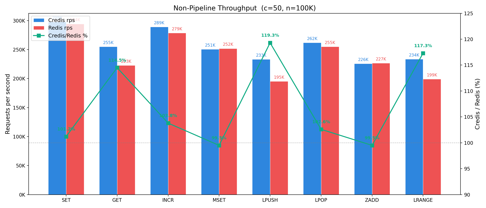
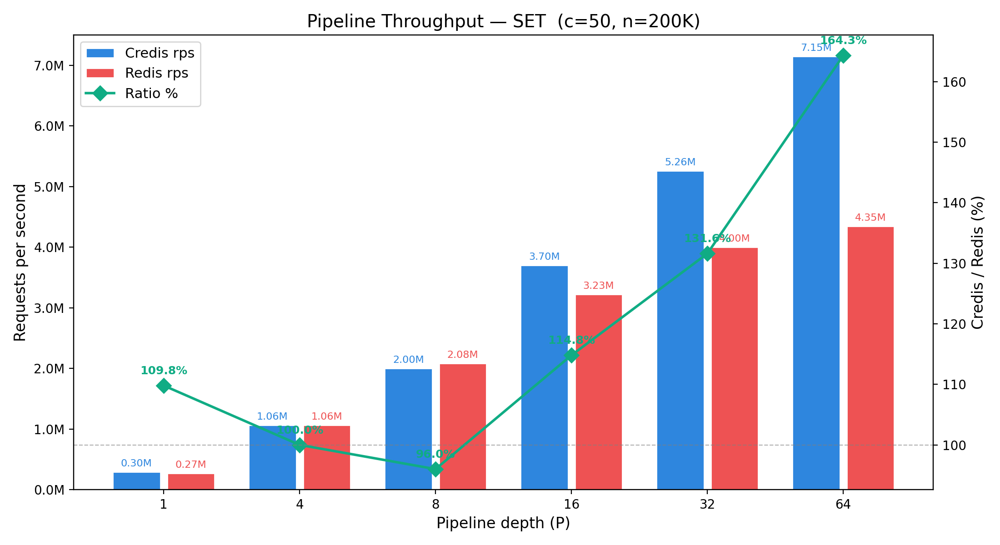
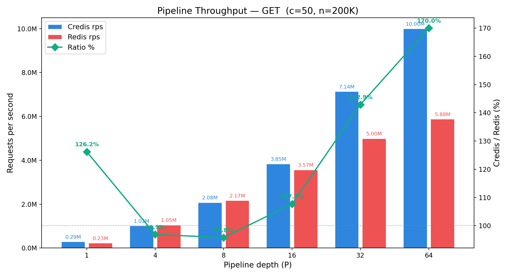
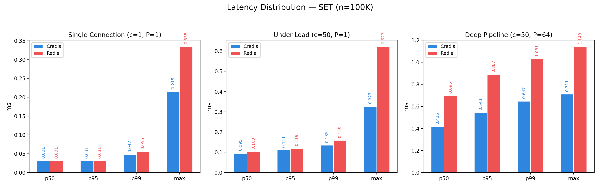
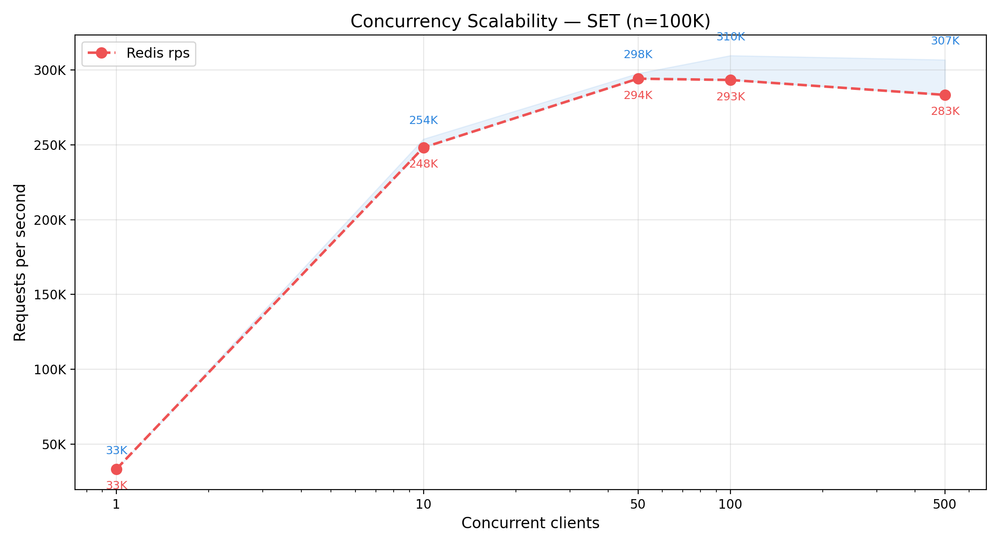

# Credis

[](https://github.com/Tenaryo/Credis/actions/workflows/ci.yml)
[](LICENSE)
[](https://en.cppreference.com/w/cpp/23)

A Redis 7.0-compatible server written from scratch in C++23 — 5,175 lines, zero dependencies, 394 KB stripped binary. Pipeline throughput (P=64) reaches 170% of Redis at 37% lower tail latency; high-concurrency throughput leads by 5–15%.

## Dependencies

- **C++23** compiler (GCC 13+ recommended)
- **CMake** 3.21+
- **Ninja** build system
- **POSIX** (epoll, sockets)

No Boost, no libevent, no hiredis.

## Performance

### Methodology

- **Hardware**: Apple M5 (aarch64, 10 cores), loopback TCP
- **Throughput**: `redis-benchmark -n 100000 -c 50 -q` (non-pipeline), `-n 200000` (pipeline)
- **Latency**: `redis-benchmark -n 100000` (non-quiet, p50/p95/p99/max parsed from summary)
- Persistence disabled on both servers
- **Credis**: `-O3 -march=native` + LTO (Release build)
- **Redis**: 7.2.8 (auto-built by `run_benchmarks.sh`)
- **Statistics**: 3 repeats per data point, reported as median

### Non-Pipeline Throughput (c=50, n=100K)



### Pipeline Throughput (c=50, n=200K)

#### SET



#### GET



Credis pipeline throughput reaches **164%** (SET) and **170%** (GET) of Redis at P=64.

### Latency Distribution (SET, n=100K)



At P=64, Credis delivers 164–170% throughput with p99 latency **37% lower** than Redis (0.647 ms vs 1.031 ms).

### Concurrency Scalability (SET, n=100K)



Credis scales from 253K to 307K rps across 10–500 concurrent clients (variance 18%), while Redis plateaus at 248–283K.

## Quick Start

### Build

```bash
./build.sh          # Debug build (default)
./build.sh Release  # Release build
```

### Run Tests

```bash
./run_tests.sh      # 161 tests across all modules
```

### Run Benchmarks

```bash
./run_benchmarks.sh            # Full Credis vs Redis benchmark
./run_benchmarks.sh --quick    # Quick mode (30K reqs)
```

Self-contained — auto-builds Redis 7.2.8 from source, no pre-installed Redis required.

### Start the Server

```bash
./build/redis                        # Default port 6379
./build/redis --port 6380            # Custom port
./build/redis --replicaof "localhost 6379"  # As replica
./build/redis --dir /data --dbfilename dump.rdb  # Load RDB on startup
```

### CLI Options

| Option | Description | Default |
|--------|-------------|---------|
| `--port <port>` | Server listening port | `6379` |
| `--replicaof "<host> <port>"` | Run as replica of the given master | (master mode) |
| `--dir <path>` | Data directory for RDB/AOF | current dir |
| `--dbfilename <name>` | RDB file name | (none) |
| `--appendonly <yes\|no>` | Enable AOF persistence | `no` |
| `--appenddirname <name>` | AOF subdirectory name | `appendonlydir` |
| `--appendfilename <name>` | AOF file base name | `appendonly.aof` |
| `--appendfsync <strategy>` | fsync policy: `always` / `everysec` | `everysec` |

### Connect

```bash
redis-cli -p 6379
> SET mykey hello
OK
> GET mykey
"hello"
> ZADD leaderboard 100 alice
(integer) 1
> XADD mystream * name alice
"1745000000000-0"
```

## Features

### Data Structures (Redis 7.0 Compatible)

5 core Redis data types with extra Geo spatial support:

| Type | Commands | Underlying Implementation |
|------|----------|--------------------------|
| **String** | SET (EX/PX), GET, INCR, MSET | `std::string` with optional TTL |
| **List** | LPUSH, RPUSH, LPOP, RPOP, LRANGE, LLEN | `std::deque<std::string>` |
| **Stream** | XADD (auto-ID), XRANGE, XREAD | binary search over `std::vector`, O(log N) |
| **Sorted Set** | ZADD, ZRANK, ZRANGE, ZCARD, ZSCORE, ZREM | `std::set<pair<double,string>>` + index map |
| **Geo** | GEOADD, GEOPOS, GEODIST, GEOSEARCH | Z-order curve (GeoHash 26-bit) + Haversine |

5 core Redis data types with extra Geo spatial support.

### Blocking Operations

Blocking commands suspend the client until data is available or timeout:

- **BLPOP** `key timeout` — blocks until a list element is available; awakened by RPUSH/LPUSH
- **XREAD BLOCK** `timeout STREAMS key id` — blocks until a new stream entry arrives; awakened by XADD

Blocked clients are managed by `BlockingManager` with per-key wait queues and per-fd deadline tracking. Timeout `0` means wait indefinitely.

### Optimistic Transactions (MULTI/EXEC/WATCH)

Full Redis-compatible transaction pipeline with optimistic locking:

- **MULTI** — begin transaction (commands are queued, not executed)
- **EXEC** — execute all queued commands atomically, or return `nil` if watched keys were modified
- **DISCARD** — abort and clear the queue
- **WATCH** / **UNWATCH** — CAS-based optimistic locking via per-key version counters

Watched keys track their version at WATCH time. EXEC checks all versions — if any changed, the entire transaction is aborted (`*-1` null array).

### Replication & Consistency (Master-Replica)

Master-replica replication with eventual consistency and synchronous WAIT:

- **PSYNC** — full resynchronization: master sends `FULLRESYNC <replid> <offset>` + empty RDB
- **REPLCONF** — replica handshake (`listening-port`, `capa psync2`) and ACK propagation
- **Command propagation** — write commands are broadcast in raw RESP format to all connected replicas
- **WAIT** `numreplicas timeout_ms` — block until `numreplicas` replicas have acknowledged up to the current offset (synchronous replication barrier)

`ReplicaManager` tracks per-replica offsets and computes acknowledged count for WAIT satisfaction. `ReplicaConnector` handles the handshake lifecycle (PING → REPLCONF×2 → PSYNC → RDB load → command stream).

### Persistence (RDB + AOF)

**RDB** (snapshot loading):
- Parses binary RDB format: `REDIS` magic, metadata headers (0xFA), database selectors (0xFE/0xFB), expiry timestamps (0xFD/0xFC), string values (0x00)
- Expired keys are skipped during load
- Loaded via `--dir`/`--dbfilename` flags at startup

**AOF** (append-only file, Redis 7+ manifest style):
- Manifest-driven: `appendonly.aof.manifest` → `file <name>.1.incr.aof seq 1 type i`
- Write commands appended in raw RESP format to the incremental file
- `appendfsync always` — `fsync()` after every write command (zero data loss)
- `appendfsync everysec` — (planned: background fsync thread)
- **Replay on startup**: reads manifest, finds the type `i` entry, parses RESP commands, and executes them to rebuild state — all before accepting client connections

### ACL & Authentication

- **AUTH** `username password` — authenticate a connection
- **ACL WHOAMI** — returns current user (`"default"`)
- **ACL SETUSER** `username >password` — set/update user password
- **ACL GETUSER** `username` — inspect user flags and password hashes
- Default `nopass` user: connections authenticate automatically on first command
- SHA-256 password hashing; `authenticated_fds` per-connection tracking

### Publish / Subscribe

- **SUBSCRIBE** `channel` — subscribe to a channel
- **UNSUBSCRIBE** `channel` — unsubscribe
- **PUBLISH** `channel message` — broadcast to all subscribers
- Subscribed connections are restricted to SUB/UNSUB/PING/QUIT commands only
- PING in subscribed mode returns `["pong", ""]`

### RESP Protocol

Complete Redis Serialization Protocol (RESP3):

- **Parsing**: single-pass, zero-copy `parse_one()` — parses one complete command from a byte buffer (`*<n>\r\n$<len>\r\n...`)
- **Encoding**: simple strings (`+`), bulk strings (`$`), integers (`:`), arrays (`*`), nulls, errors (`-`)
- **Pipelining**: multiple commands in one TCP packet are parsed and executed sequentially, with batch response assembly

### Event-Driven I/O (epoll)

- `EventLoop` wraps Linux `epoll` with sigfd-based signal handling (SIGINT/SIGTERM)
- `ConnectionPool` manages per-fd read/write buffers with dynamic expansion (4 KB → 512 MB)
- `TcpListener` with `SO_REUSEADDR` and backlog 511
- Batch output flush reduces `write()` syscalls
- Single-threaded, event-driven architecture — no thread pools, no context switches

### Config Management

- **CONFIG GET** `param` — query `dir`, `dbfilename`, `appendonly`, `appenddirname`, `appendfilename`, `appendfsync`
- All AOF config values overridable via command-line flags (see CLI Options)

## Supported Commands

### General
- `PING`, `ECHO`, `INFO`, `CONFIG GET`, `KEYS`, `TYPE`

### Strings
- `SET` (with EX/PX), `GET`, `INCR`, `MSET`

### Lists
- `LPUSH`, `RPUSH`, `LPOP`, `RPOP`, `LRANGE`, `LLEN`, `BLPOP`

### Streams
- `XADD` (auto-ID), `XRANGE`, `XREAD`, `XREAD BLOCK`

### Sorted Sets
- `ZADD`, `ZRANK`, `ZRANGE`, `ZCARD`, `ZSCORE`, `ZREM`

### Geo
- `GEOADD`, `GEOPOS`, `GEODIST`, `GEOSEARCH`

### Pub/Sub
- `SUBSCRIBE`, `UNSUBSCRIBE`, `PUBLISH`

### Transactions
- `MULTI`, `EXEC`, `DISCARD`, `WATCH`, `UNWATCH`

### Replication & Auth
- `REPLCONF`, `PSYNC`, `WAIT`, `AUTH`, `ACL WHOAMI`, `ACL GETUSER`, `ACL SETUSER`

**45 commands** total.

## API Documentation

Generate with [Doxygen](https://www.doxygen.nl/):

```bash
doxygen Doxyfile
```

HTML output in `docs/html/`.

## Contributing

See [CONTRIBUTING.md](CONTRIBUTING.md) for build instructions, code style, commit conventions, and the PR process.

## Changelog

See [CHANGELOG.md](CHANGELOG.md) for a history of project changes.

## License

This project is licensed under the [MIT License](LICENSE).
